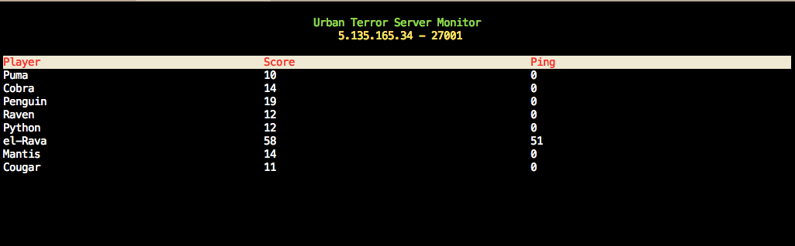

## Urban Terror Server Monitor

It's a handy tool to monitor the players on a certain UrT server. 

#### Installation

`Python 3` is required. So please make sure you're using the Python 3 version of `pip`.

    pip install urt
    
On some systems, Python 3's pip is named `pip3`. So the command becomes:

    pip3 install urt
    
You might also need `sudo` privilege to install packages on some systems. Append `sudo` at the beginning. 

    sudo pip install urt
    sudo pip3 install urt

#### Usage

    urt 5.135.165.34 27001

Press any key to exit. 

